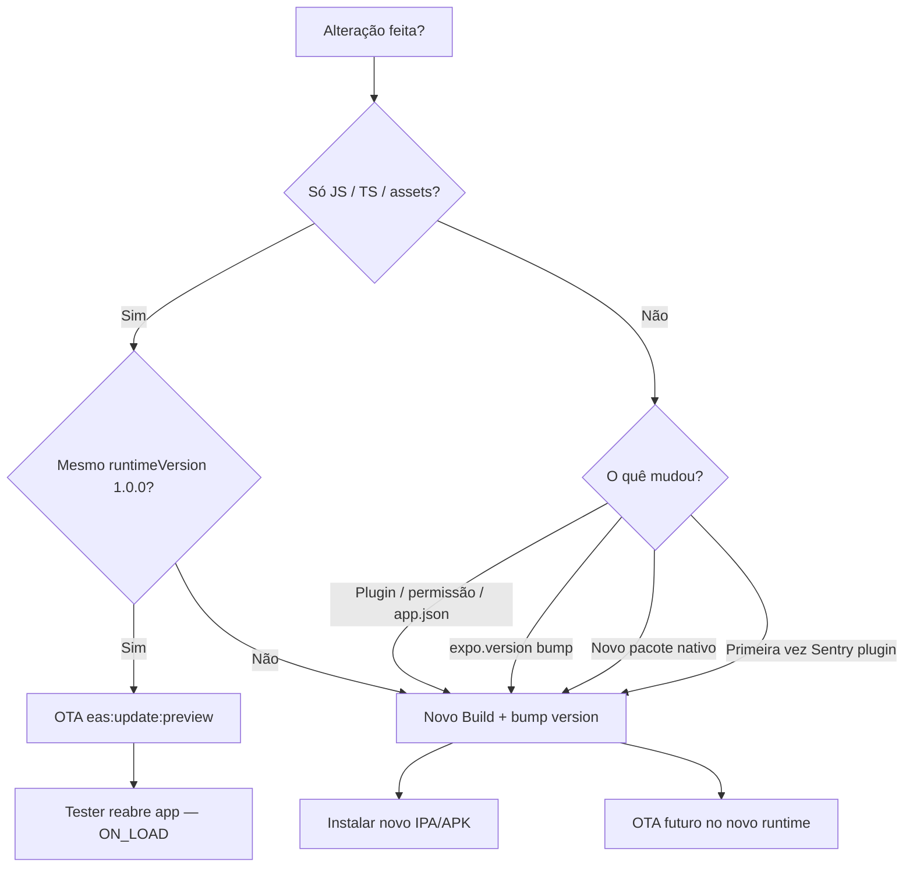

# Build & Release Audit — CentFlow RC2

> Principal Mobile Release Engineer audit — Julho 2026  
> **Objectivo:** validar prontidão para `eas build` beta antes de desperdiçar builds.  
> **Nenhum build EAS, OTA, commit ou push executado.**

---

## Validação executada

| Comando | Resultado |
|---------|-----------|
| `npm test` | **487/487 PASS** |
| `npx tsc --noEmit` | **0 erros** |
| `expo config --type public` | ✅ (default + `EAS_BUILD_PROFILE=beta`) |
| `npm run handoff` | ✅ HANDOFF.md regenerado |

---

## Scores

| Dimensão | Score | Justificação |
|----------|-------|--------------|
| **Build Readiness** | **82/100** | Config EAS/Expo coerente; plugins OK; 2 warnings nativos (expo-video, Sentry env) |
| **Native Readiness** | **78/100** | Plugins alinhados SDK 56; RECORD_AUDIO fantasma; dev client em falta (só dev) |
| **Release Readiness** | **52/100** | Dashboards externos não validados; beta ≠ TestFlight/Play path; jurídico pendente |

---

## Recomendação final

| Destino | Veredicto |
|---------|-----------|
| ❌ NÃO GERAR BUILD | — |
| 🟡 **GERAR BUILD INTERNO** | **← RECOMENDADO AGORA** |
| 🟢 PRONTO PARA TESTFLIGHT INTERNAL | — |
| 🟢 PRONTO PARA GOOGLE PLAY CLOSED TESTING | — |

### Justificação

O repositório está **pronto para o primeiro `eas build --profile beta`** (APK Android + IPA iOS via distribuição interna EAS). Não há bloqueador técnico local que faça falhar o build.

**Não** está pronto para TestFlight Internal nem Google Play Closed Testing com o perfil actual:
- iOS `beta` usa `distribution: internal` (sideload), não App Store Connect / TestFlight
- Android `beta` gera **APK**, não **AAB** para Play Console
- Credenciais submit, providers OAuth e secrets Supabase = Pendente validação externa

---

## 1. Auditoria EAS

Ver detalhe: [`docs/build-audit.md`](docs/build-audit.md)

| Item | Estado |
|------|--------|
| projectId | ✅ |
| Perfis beta/preview/production | ✅ |
| Env Supabase beta | ✅ |
| Canal OTA preview alinhado | ✅ |
| autoIncrement production | ✅ |
| submit placeholders | ❌ FAIL |
| beta → TestFlight | ❌ distribuição errada |
| beta → Play Closed | ❌ formato APK |

---

## 2. Auditoria Expo

| Campo | Valor | OK |
|-------|-------|-----|
| SDK | 56.0.0 | ✅ |
| version | 1.0.0 | ✅ |
| runtimeVersion | appVersion → 1.0.0 | ✅ |
| scheme | centflow | ✅ |
| newArchEnabled | false | ✅ |
| orientation | portrait | ✅ |
| updates.checkAutomatically | ON_LOAD | ✅ |
| owner | manuc98 | ✅ |

`expo config` com perfil beta confirma inject de Supabase e nome «CentFlow Beta».

---

## 3. Auditoria plugins

| Plugin | PASS/FAIL |
|--------|-----------|
| expo-router | PASS |
| expo-apple-authentication | PASS |
| expo-secure-store | PASS |
| expo-image-picker | PASS |
| expo-local-authentication | PASS |
| expo-notifications | PASS |
| expo-updates | PASS |
| expo-ocr-kit | PASS |
| expo-web-browser | PASS |
| expo-sharing | PASS |
| @react-native-community/datetimepicker | PASS |
| @sentry/react-native | PENDENTE (env) |
| **expo-video** | **FAIL** (sem uso, RECORD_AUDIO) |
| expo-dev-client | FAIL (só perfil development) |

---

## 4. Auditoria Supabase

### Validado localmente

| Item | Estado |
|------|--------|
| URL + anon key em eas.json | ✅ |
| Código OAuth Google + Apple | ✅ |
| Deep links documentados em código | ✅ |
| `delete_own_account` migration | ✅ |
| RLS em migrations | ✅ |
| Storage bucket receipts migration | ✅ |
| Edge Functions em `supabase/functions/` | ✅ |
| `database.types.ts` inclui `delete_own_account` | ✅ |

### Pendente Dashboard

| Item |
|------|
| Google provider activo |
| Apple provider activo |
| Redirect URLs (`centflow://auth/callback`, etc.) |
| Google Cloud redirect URI + SHA-1 Android |
| Migrations aplicadas remotamente |
| `GOOGLE_VISION_API_KEY` |
| `GOCARDLESS_*` secrets |
| `ANTHROPIC_API_KEY` |
| Edge Functions deployed |
| Email cron / Resend production |

---

## 5. Build blockers

Bloqueadores que **impediriam compilar** o perfil `beta`:

**Nenhum encontrado.**

---

## 6. Build warnings

| # | Warning | Acção sugerida (próximo sprint) |
|---|---------|----------------------------------|
| W1 | `expo-video` plugin sem imports — injecta `RECORD_AUDIO` | Remover plugin + dependência, ou `blockedPermissions` |
| W2 | Perfil `beta` internal ≠ TestFlight | Usar `production` + `eas submit` para TF |
| W3 | APK beta ≠ Play Closed AAB | `eas:build:production:android` para Console |
| W4 | Sentry DSN + plugin env ausentes no beta | Opcional; definir em EAS Secrets se quiser crash reporting |
| W5 | `expo-dev-client` ausente | Instalar se usar perfil `development` |
| W6 | `eas submit` placeholders | Preencher antes de submissão lojas |
| W7 | Compliance docs dizem RECORD_AUDIO removido — config resolvido mostra o contrário | Actualizar docs pós-fix W1 |

---

## 7. Checklist Android (pré-build beta)

| Item | Estado |
|------|--------|
| version 1.0.0 | ✅ |
| package com.everyft1me.centflow | ✅ |
| runtimeVersion 1.0.0 | ✅ |
| OTA canal preview | ✅ |
| Plugins | ✅ |
| Ícones + splash | ✅ |
| MOCK desligado | ✅ |
| Google Login código | ✅ — Dashboard pendente |
| Privacy + Terms in-app | ✅ |
| buildType apk | ✅ (sideload) |

---

## 8. Checklist iOS (pré-build beta)

| Item | Estado |
|------|--------|
| version 1.0.0 | ✅ |
| bundleIdentifier | ✅ |
| deploymentTarget 16.4 | ✅ |
| usesAppleSignIn | ✅ |
| runtimeVersion + canal | ✅ |
| Permissões strings (Face ID, câmara, fotos) | ✅ |
| Apple Login código | ✅ — Apple Developer pendente |
| Privacy + Terms in-app | ✅ |
| Credenciais EAS | Pendente validação externa |

---

## 9. Smoke P0 (máx. 20 — ordenados)

Executar **após** instalar o primeiro build beta. Nenhum executado.

| # | Teste | Porquê P0 |
|---|-------|-----------|
| 1 | Instalação fresh APK/IPA beta | Valida artefacto EAS |
| 2 | Primeiro arranque — modal consentimento | Bloqueia analytics/Sentry |
| 3 | Onboarding completo (17 passos) | Gate até tabs |
| 4 | Login email + sessão persistente | Base da app |
| 5 | Google Login (Android + iOS) | OAuth nativo + redirect |
| 6 | Apple Login (iOS only) | Guideline 4.8 + plugin nativo |
| 7 | Home skeleton → dados reais Supabase | Core UX |
| 8 | Adicionar movimento manual | Motor financeiro |
| 9 | Editar movimento | Optimistic update |
| 10 | Eliminar movimento | Integridade ledger |
| 11 | OCR — abrir câmara (permissão) | Plugin nativo |
| 12 | OCR falha → mensagem humana, sem crash | Edge Function / fallback |
| 13 | Logout → login sem mistura de dados | SecureStore |
| 14 | Sem internet → ErrorState + retry | Offline UX |
| 15 | Kill app → reopen (sessão) | Persistência |
| 16 | Delete Account (conta teste) | Compliance lojas |
| 17 | Política + Termos in-app acessíveis | Compliance |
| 18 | Export JSON (Definições) | GDPR |
| 19 | Deep link `centflow://quick-expense` | Scheme + router |
| 20 | OTA preview recebe update (pós 1.º build) | Canal alinhado |

Lista completa: [`docs/smoke-test-checklist.md`](docs/smoke-test-checklist.md)

---

## 10. OTA vs Novo Build — árvore de decisão



| Cenário | Acção |
|---------|-------|
| Fix UI, copy, lógica JS | OTA `preview` |
| Novo ícone, splash, permissão | Novo build |
| Adicionar/remover `expo-*` plugin | Novo build |
| `1.0.0` → `1.1.0` | Novo build (runtime muda) |
| Activar Sentry plugin (env) | Novo build |
| Remover expo-video (fix RECORD_AUDIO) | Novo build |

---

## 11. Riscos Release-only

| Risco | Falha em Debug? | Falha em Release? |
|-------|-----------------|-------------------|
| Google SHA-1 mismatch | Pode passar em dev | Sim — Android OAuth |
| Apple capability ausente | Simulador limitado | Sim — Apple Login |
| GOOGLE_VISION_API_KEY ausente | OCR cloud falha | Sim — fallback manual |
| expo-ocr-kit nativo | Fallback JS | Depende do build |
| Sentry sem DSN | Silencioso | Silencioso (gated) |
| RECORD_AUDIO no manifest | N/A | Play review risk |

---

## 12. Próximos passos (ordem)

1. **🟡 Gerar builds beta**
   ```bash
   npm run eas:build:beta:android
   npm run eas:build:beta:ios
   ```
2. Instalar em dispositivos → executar Smoke P0 (§9)
3. Paralelo: configurar Supabase providers + redirect URLs (Dashboard)
4. Corrigir W1 (remover `expo-video`) antes de Play submission
5. Para TestFlight: `eas:build:production:ios` + credenciais ASC + `eas submit`
6. Para Play Closed: `eas:build:production:android` (AAB) + service account

---

## 13. Documentação gerada

| Ficheiro | Conteúdo |
|----------|----------|
| [`docs/build-audit.md`](docs/build-audit.md) | Auditoria técnica EAS/Expo/plugins |
| [`RC2_BUILD_CHECKLIST.md`](RC2_BUILD_CHECKLIST.md) | PASS/FAIL/PENDENTE por item |
| [`BUILD_RELEASE_AUDIT.md`](BUILD_RELEASE_AUDIT.md) | Este documento |
| [`REAL_DEVICE_VALIDATION_PLAN.md`](REAL_DEVICE_VALIDATION_PLAN.md) | Campanha device (sprint anterior) |
| [`RC1_RELEASE_GATE.md`](RC1_RELEASE_GATE.md) | Gate distribuição |

---

## 14. Alterações de código

**Nenhuma.** O bloqueador `expo-video` / `RECORD_AUDIO` é warning de release, não impede compilação do perfil beta. Correcção recomendada antes de submissão Play, não antes do 1.º build interno.
