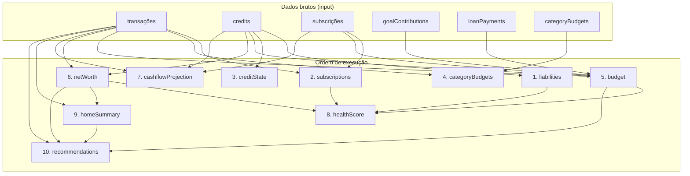

# Motor Financeiro — `lib/domain/financial/engine.ts`

Orquestração central do estado financeiro derivado. **Não reimplementa fórmulas** — cada passo delega para módulos já testados.

## Entrada

```ts
recalculateFinancialState(userId, input, trigger, options?)
```

- `input`: snapshot de dados brutos (transações, créditos, subscrições, etc.)
- `trigger`: evento que originou o recálculo (`transaction_created`, `goal_updated`, …)
- `options.stepRunners`: injecção para testes (mock/isolamento de falhas)

## Saída em background (app)

```ts
scheduleFinancialRecalculation(queryClient, userId, trigger)
```

1. Recolhe dados do cache TanStack Query (`engine.gather.ts`)
2. Corre `recalculateFinancialState` em `queueMicrotask` (não bloqueia UI)
3. Grava snapshot em `queryKeys.financialEngine(userId)`
4. Invalida queries derivadas (`engine.invalidation.ts`)

## Mapa de dependências



### Recomendações (`recommendations.ts`)

Passo final do pipeline — chama `generateRecommendations(calculateFinancialState(...))` com:

| Regra | Origem da lógica |
|-------|------------------|
| Dívida vs investimento | `credit-analysis`, `resolveDebtEffectiveAnnualRate`, `simulateEarlyAmortization` |
| Excedente sem destino | `calculateRealSavingsMargin`, `buildDebtAmortizationAction` / `buildSavingsAllocationAction` |
| Categoria acima da mediana | `getPreviousCompleteMonthKeys`, mediana mensal por categoria |
| Fundo de emergência | `sumMonthlyDebtPayments`, subscrições mensais |

Anti-repetição: `recommendation-fired.storage` guarda fingerprint + data; mesma regra no dia seguinte com os mesmos números é suprimida.

Toggles em Definições → Sugestões financeiras (`UserPreferences.recommendation*`).

### O que cada passo reutiliza

| Passo | Módulo existente | Função |
|-------|------------------|--------|
| `liabilities` | `lib/domain/financial/liabilities.ts` | `sumCreditLiabilities`, `sumMonthlyDebtPayments` |
| `subscriptions` | `lib/subscriptions/detect-subscriptions.ts` | `detectSubscriptionsFromTransactions` |
| | `lib/domain/financial/centflow-score.ts` | `monthlySubscriptionTotal` |
| | `lib/subscriptions/renewal.utils.ts` | `countRenewalsSoon` |
| `creditState` | `lib/credit/credit-analysis.ts` | `analyzeCredit` (por crédito) |
| | `lib/domain/financial/metrics.ts` | `summarizeCreditExposure` |
| `categoryBudgets` | `lib/domain/financial/category-budgets.ts` | `calculateCategoryBudgetStatus` |
| `budget` | `lib/domain/financial/monthly-available.compose.ts` | `buildMonthlyAvailableBreakdown` |
| `netWorth` | `lib/domain/financial/netWorth.ts` | `calculateNetWorth` |
| | `lib/domain/net-worth-monthly.ts` | `calculateMonthlyNetWorthMetrics` |
| `cashflowProjection` | `lib/domain/financial/cashflow-projection.ts` | `buildCashflowProjection` |
| `healthScore` | `lib/domain/financial/centflow-score.ts` | `calculateCentFlowScore` |
| `homeSummary` | `lib/home/smart-summary.ts` | `getSmartSummaryMessage` |
| `recommendations` | `lib/domain/financial/recommendations.ts` | `generateRecommendations` |

> **Nota sobre orçamento:** em produção usa-se `buildMonthlyAvailableBreakdown` (mesmo caminho que `calculateFinancialState`). `lib/budget/calculateMonthlySpendable.ts` é a formulação legada isolada, mantida nos seus testes unitários.

> **Nota sobre passivos:** `lib/liabilities/liabilities.service.ts` gere persistência (Supabase/local). O motor opera sobre o snapshot em cache após mutações — os cálculos derivados usam `lib/domain/financial/liabilities.ts`.

## Isolamento de falhas

Cada passo corre dentro de `try/catch`. Se `subscriptions` falhar, `budget`, `netWorth`, `healthScore`, etc. continuam. Erros são registados via `logAppEvent` com `step_failed:<nome>` e duração.

## Diagnóstico

- `debug` — `step_ok:<passo>` com `durationMs`
- `info` — `recalculation_complete` com totais
- `warn` — `step_failed:<passo>` com mensagem de erro

## Ligação às mutations

| Hook | Trigger |
|------|---------|
| `useCreateTransaction` | `transaction_created` |
| `useUpdateTransaction` | `transaction_updated` |
| `useDeleteTransaction` | `transaction_deleted` |
| `useCreateGoal` / `useUpdateGoal` | `goal_created` / `goal_updated` |
| `useCreateGoalContribution` | `goal_contribution_created` |
| `useSaveCredit` / `useDeleteCredit` | `credit_created` / `credit_updated` / `credit_deleted` |
| `useSaveSubscription` / `useDeleteSubscription` | `subscription_*` |
| `useUpsertCategoryBudget` | `category_budget_updated` |

As invalidações imediatas existentes mantêm-se para resposta rápida da UI; o motor corre em background e faz invalidação abrangente ao terminar.

## Testes

`engine.integration.test.ts`:

1. Ordem de invocação dos 10 passos
2. Falha isolada em `subscriptions` — restantes passos executam
3. Integração real com input vazio — resultados derivados presentes
